|Content|
|-------|
|[WATER TREATMENT](#water-treatment)|
|[ELECTROCHEMISTRY](#electrochemistry)|
|[SPECTROSCOPY](#spectroscopy)|
|[UV-VIS SPECTROSCOPY](#uv-vis-spectroscopy)|
|[IR SPECTROSCOPY](#ir-spectroscopy)|
|[NMR SPECTROSCOPY](#nmr-spectroscopy)|
|[POLYMERS](#polymers)|

<!--water starts-->

# WATER TREATMENT

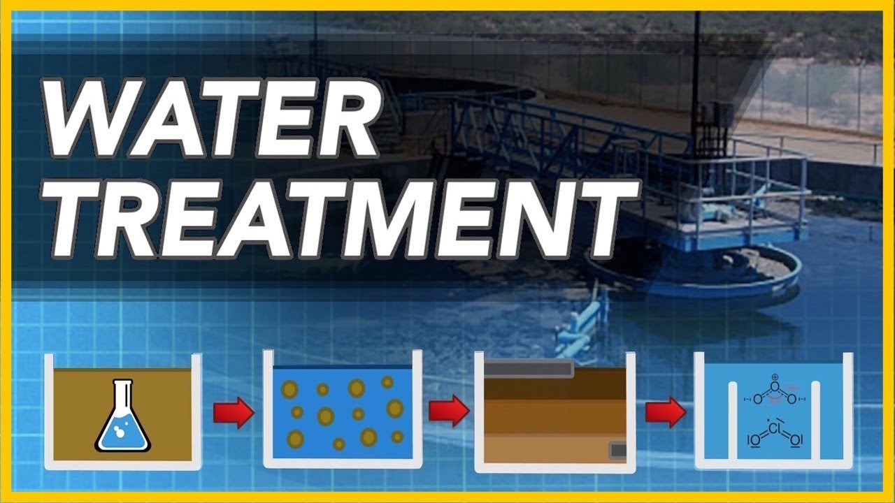

## **1. Hardness of Water**

**Definition of Hardness**  
Water hardness is primarily caused by dissolved minerals, particularly calcium (Ca²⁺) and magnesium (Mg²⁺) ions, which react with soap to form a precipitate or "scum." This reduces the soap’s ability to lather and creates build-up in pipes and appliances, leading to maintenance issues and energy inefficiencies. Hardness in water is a critical factor in industrial, agricultural, and domestic water use, as it directly impacts water quality and suitability.

**Units of Hardness**  
The hardness of water is measured in terms of the concentration of calcium carbonate (CaCO₃) equivalent because CaCO₃ provides a standard measure. Units of hardness include:
  - **Parts per million (ppm)** or **mg/L of CaCO₃**: The most commonly used unit, where 1 ppm means 1 mg of CaCO₃ per liter of water.
  - **Degree Clark (°Cl)**: 1 °Cl = 1 part of CaCO₃ per 70,000 parts of water.
  - **Degree French (°F)**: 1 °F = 1 part of CaCO₃ per 10,000 parts of water.
  
**Types of Hardness**
1. **Temporary Hardness**: Caused by dissolved bicarbonate salts like calcium bicarbonate (Ca(HCO₃)₂) and magnesium bicarbonate (Mg(HCO₃)₂). Temporary hardness can be removed by boiling, which precipitates calcium carbonate:
   
   $$
   Ca(HCO₃)₂ \rightarrow CaCO₃ ↓ + CO₂ + H₂O
   $$

2. **Permanent Hardness**: Caused by dissolved chlorides and sulfates, such as calcium chloride (CaCl₂) and magnesium sulfate (MgSO₄). Permanent hardness cannot be removed by boiling; chemical treatment is required.

**Determination of Hardness by EDTA Titration Method**  
The EDTA (Ethylenediaminetetraacetic acid) titration method is the standard procedure to measure total hardness. EDTA forms stable complexes with Ca²⁺ and Mg²⁺ ions, making it suitable for accurate quantification.

**Procedure**:

1. **Preparation**: A buffer solution is added to the water sample to maintain a pH around 10, ensuring that Ca²⁺ and Mg²⁺ ions are free to react with EDTA.
2. **Indicator**: Eriochrome Black T indicator is added, which binds with Ca²⁺ and Mg²⁺ to form a pink complex.
3. **Titration**: EDTA solution is titrated into the water sample. EDTA complexes with the Ca²⁺ and Mg²⁺ ions, replacing the indicator. The color changes from pink to blue at the endpoint, indicating that all Ca²⁺ and Mg²⁺ ions are now bound to EDTA.
  
**Calculation**:
The concentration of hardness is determined using the normality equation:

$$
\text{Hardness (mg/L as CaCO₃)} = \frac{\text{Volume of EDTA (L)} \times \text{Normality of EDTA} \times 50,000}{\text{Volume of Water Sample (mL)}}
$$

## **2. Softening of Water**

**Why Soften Water?**  
Water softening is essential to prevent scale formation, which can cause inefficiencies and damage in industrial equipment, such as boilers, pipes, and cooling towers. Hard water also reduces the effectiveness of soaps and detergents in both industrial and domestic applications.

### **Lime-Soda Method**

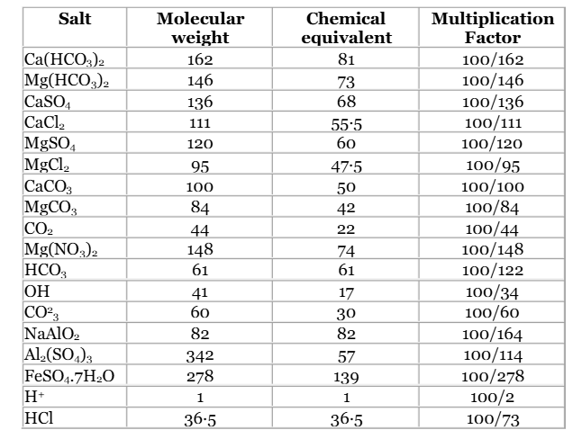

The lime-soda method is a traditional chemical process that removes both temporary and permanent hardness by precipitating calcium and magnesium as CaCO₃ and Mg(OH)₂, respectively.

**Reaction Mechanisms**:
1. **Temporary Hardness**:  
   
   $$
   Ca(HCO₃)₂ + Ca(OH)₂ \rightarrow 2CaCO₃ ↓ + 2H₂O
   $$
   
   $$
   Mg(HCO₃)₂ + 2Ca(OH)₂ \rightarrow Mg(OH)₂ ↓ + 2CaCO₃ + 2H₂O
   $$

2. **Permanent Hardness**:
   
   $$
   CaCl₂ + Na₂CO₃ \rightarrow CaCO₃ ↓ + 2NaCl
   $$
   
   $$
   MgSO₄ + Ca(OH)₂ \rightarrow Mg(OH)₂ ↓ + CaSO₄
   $$

This process is effective for large-scale water softening in municipal and industrial water treatment.

### **Ion Exchange Method**  

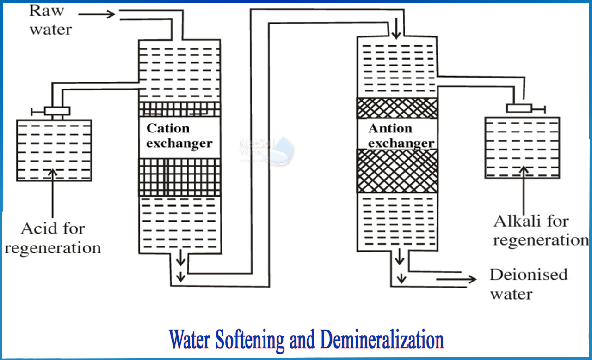

Ion exchange uses resins to swap hardness-causing ions with non-hardening ions, typically sodium (Na⁺) ions.

- **Process**: Water flows through a resin bed containing Na⁺ ions. Ca²⁺ and Mg²⁺ ions exchange with Na⁺, thus softening the water.
- **Regeneration**: When the resin becomes saturated, it is regenerated by flushing with a brine (NaCl) solution, which replaces Ca²⁺ and Mg²⁺ ions with Na⁺ ions again.

### **Zeolite Method**  

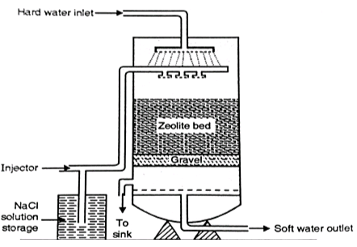

Natural or synthetic zeolites (sodium aluminosilicate minerals) exchange Na⁺ ions for Ca²⁺ and Mg²⁺ ions in hard water.

- **Process**: As hard water passes through the zeolite bed, Na⁺ ions replace Ca²⁺ and Mg²⁺ ions.
- **Advantages**: The zeolite method is efficient and economical for softening large volumes of water, such as in municipal water treatment.

## **3. Boiler Feed Water**

**Causes of Boiler Issues**  
Boiler feed water quality is essential to prevent damage and maintain efficiency. Common issues arise from impurities like calcium, magnesium, dissolved gases, and alkaline substances.

1. **Scale and Sludge Formation**:  
   
   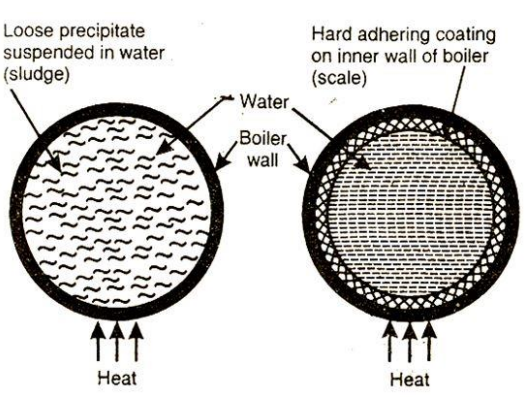
   
   - **Scale** is a hard deposit formed when dissolved salts precipitate out. It typically occurs at high temperatures and pressures.
   - **Sludge** consists of loose, soft deposits that settle at the bottom, mainly due to suspended impurities.

2. **Priming and Foaming**:  
   
   
   
   - **Priming**: Rapid boiling causes water droplets to mix with steam, reducing steam purity.
   - **Foaming**: Formation of foam at the water surface, often due to organic impurities or dissolved solids, which leads to contamination and reduced efficiency.

3. **Caustic Embrittlement**:  
   
   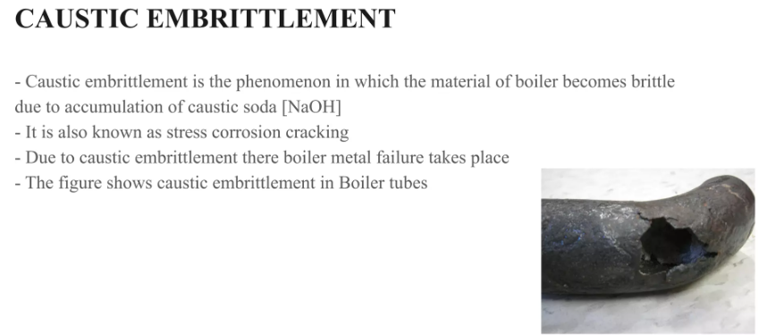
   
   - Occurs due to high concentrations of sodium hydroxide (NaOH) in boiler water, making the metal brittle and prone to cracking. This is a common issue in high-pressure boilers.

4. **Boiler Corrosion**:  
   - Caused by dissolved oxygen, carbon dioxide, and acidic contaminants in water, which lead to rusting and material degradation.

**Prevention and Removal**  

1. **Scale and Sludge**: Prevented by treating feed water to remove hardness or by adding anti-scaling agents.
2. **Priming and Foaming**: Anti-foaming agents and controlled boiler pressure are used.
3. **Caustic Embrittlement**: Adding sodium phosphate to the feed water or maintaining optimal pH levels.
4. **Boiler Corrosion**: Deaeration to remove oxygen and CO₂ or adding chemical inhibitors.

## **4. Water Purification for Drinking**

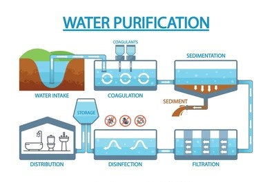

**Steps for Drinking Water Purification**  
Ensuring water quality for drinking involves multiple steps to remove physical, chemical, and biological contaminants.

1. **Sedimentation**: Settling process that removes heavy suspended particles by allowing them to settle at the bottom of the tank.
2. **Filtration**: Sand or gravel filters remove smaller suspended particles. Advanced systems may use activated carbon filters to remove organic contaminants.
3. **Flocculation and Coagulation**: Chemicals (like alum) are added to form larger particles (flocs) that settle or filter out easily.
4. **Sterilization**: This step kills pathogens, using methods such as:
   - **Chlorination**: Adding chlorine gas or bleaching powder for disinfection.
   - **Chloramines**: Longer-lasting disinfectants used to keep water pathogen-free in distribution systems.
   - **Ozone Treatment**: A powerful oxidant that kills bacteria and viruses without leaving a residual taste.
   - **UV Sterilization**: UV light disrupts the DNA of pathogens, killing them effectively.

## **5. Desalination of Brackish Water**

Desalination is crucial for providing fresh water in regions with limited freshwater resources. Two primary methods are:

1. **Electrodialysis**:  
   
   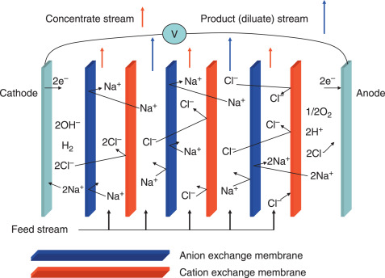
   
   - Uses an electric field to drive ions through selective membranes, separating salt from water. Effective for low-to-moderate salinity levels.

2. **Reverse Osmosis (RO)**:  
   
   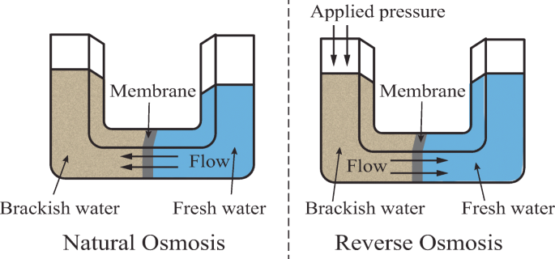

   - High-pressure water is pushed through a semipermeable membrane that allows water molecules through but retains salts and impurities.
   - RO is widely used for its effectiveness and efficiency in producing potable water from brackish or seawater.

--- 
<!--water ends-->

<!--electrochemistry starts-->

# ELECTROCHEMISTRY

## 1. **Electrode and Electrode Potential**

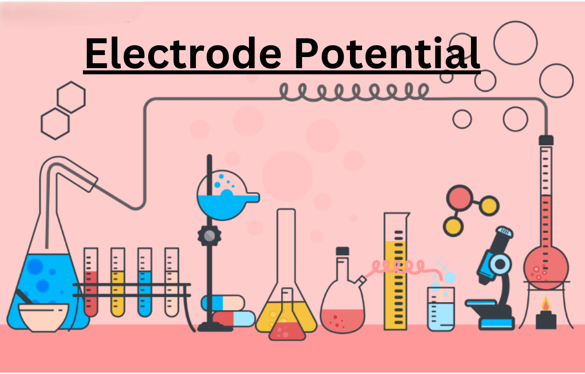

**Electrode:**
An electrode is a crucial part of any electrochemical cell, serving as the point of contact between an electrical conductor (such as a wire) and an electrolyte (solution containing ions). In an electrochemical cell, there are generally two electrodes:

1. **Anode**: The electrode where oxidation takes place. During oxidation, atoms at the anode lose electrons and become ions, which then enter the electrolyte. This process results in a build-up of electrons in the anode, giving it a negative charge relative to the electrolyte. 

2. **Cathode**: The electrode where reduction occurs. Here, ions in the electrolyte gain electrons from the cathode, converting them back into atoms. This movement of electrons toward the cathode makes it positively charged in comparison to the anode.

The types of electrodes can vary based on their materials and the reactions they participate in. They can be inert, like platinum (which does not participate in the reaction), or active, where the electrode material itself is part of the electrochemical reaction.

**Electrode Potential:**
The electrode potential of an electrode is the measure of the tendency of the electrode to gain or lose electrons when in contact with an electrolyte. It can be divided into:

- **Oxidation potential**: Indicates the tendency of an electrode to lose electrons and undergo oxidation. 
- **Reduction potential**: Indicates the tendency of an electrode to gain electrons and undergo reduction.

The electrode potential of a half-cell depends on factors such as ion concentration, temperature, and the type of metal used for the electrode. This value changes with the conditions, which is why electrode potentials are typically measured under standardized conditions and termed **standard electrode potentials (E°)**. Standard conditions are 1 M concentration for solutions, 1 atm for gases, and a temperature of 25°C (298 K).

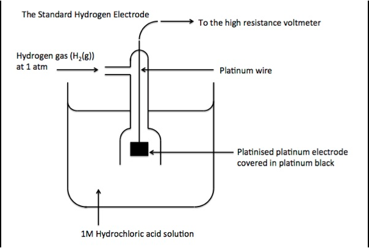

The **standard hydrogen electrode (SHE)** is commonly used as a reference electrode with a defined electrode potential of 0 V, against which other electrodes' potentials are measured. The SHE consists of a platinum electrode in contact with 1 M H⁺ ions and H₂ gas at 1 atm. By connecting different electrodes to the SHE, we can determine their standard electrode potentials.

## 2. **Electrochemical Series**

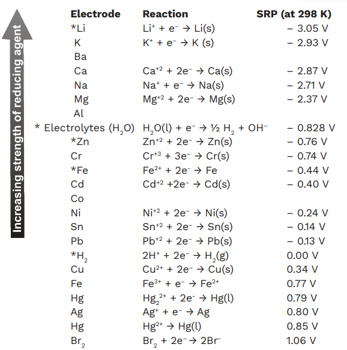

The electrochemical series, also known as the activity series, is a list of chemical elements ordered by their standard electrode potentials. Elements are arranged from the most reactive (those that have a high tendency to lose electrons, like lithium) to the least reactive (those with a high tendency to gain electrons, like gold). 

- **Positive Electrode Potentials**: Elements with high positive potentials tend to gain electrons and are good oxidizing agents. These are generally non-metals, with fluorine and chlorine at the top.
  
- **Negative Electrode Potentials**: Elements with negative potentials tend to lose electrons easily and act as strong reducing agents. Metals like lithium, potassium, and sodium have negative potentials and are very reactive.

**Applications of Electrochemical Series:**
1. **Predicting the feasibility of redox reactions**: In a redox reaction, a substance with a lower (more negative) electrode potential can reduce a substance with a higher electrode potential.
   
2. **Determining reactivity**: The series helps in determining which metals will displace others from solution; for example, a metal with a higher reactivity will displace a less reactive metal from its salt solution.

3. **Corrosion prediction**: Metals with lower electrode potentials are more prone to corrosion than those with higher potentials, making the series useful in materials science and engineering.

## 3. **Electrochemical Cell and Its Representation**

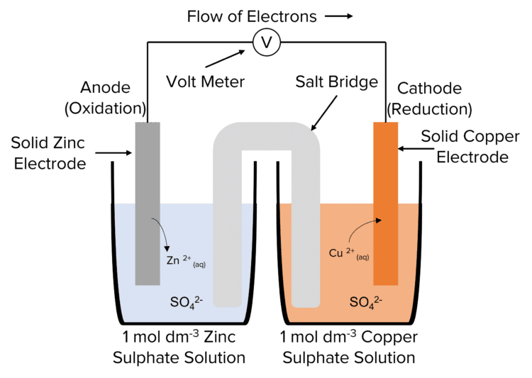

An **electrochemical cell** converts chemical energy into electrical energy through redox reactions. The primary types of electrochemical cells are **galvanic cells** (spontaneous reactions) and **electrolytic cells** (non-spontaneous reactions).

- **Galvanic (Voltaic) Cell**: In a galvanic cell, the redox reaction is spontaneous, producing electric current. It consists of two half-cells connected by a salt bridge that completes the circuit and prevents charge build-up. An example is the Daniell cell, where zinc and copper electrodes are placed in their respective sulfate solutions.

  **Representation**: A galvanic cell can be represented as:
  
  $$
  \text{Zn | Zn}^{2+} (1\ \text{M}) || \text{Cu}^{2+} (1\ \text{M}) | \text{Cu}
  $$
  
  where “||” separates the different phases in each half-cell, and “||” represents the salt bridge.

## 4. **Nernst Equation and Its Applications**

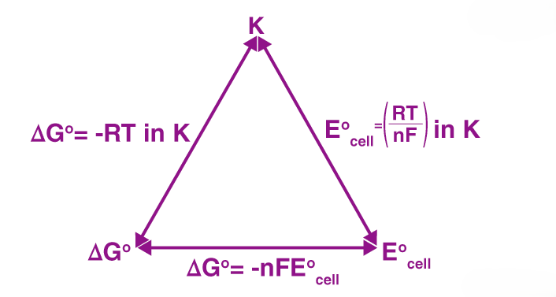

The **Nernst Equation** relates the electrode potential of a cell to the concentration of the ions involved in the redox reaction. It’s given by:

$$
E = E^\circ - \frac{RT}{nF} \ln Q
$$

where:
- \( E \): Electrode potential,
- \( E^\circ \): Standard electrode potential,
- \( R \): Universal gas constant (8.314 J/mol·K),
- \( T \): Temperature in Kelvin,
- \( n \): Number of electrons transferred,
- \( F \): Faraday’s constant (96485 C/mol),
- \( Q \): Reaction quotient.

In terms of concentration, at 298 K, the equation can be simplified to:

$$
E = E^\circ - \frac{0.0591}{n} \log Q
$$

**Applications**:
1. **Calculating cell potential** at non-standard conditions.
2. **Determining equilibrium constant** for redox reactions.
3. **pH measurement** using the hydrogen electrode.

## Types of Electrodes

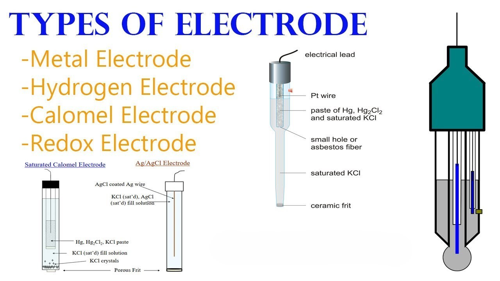

Electrodes are categorized based on their materials, functions, and the type of reactions they undergo in an electrochemical cell. The primary types of electrodes are:

1. **Metal-Metal Ion Electrodes**
2. **Gas Electrodes**
3. **Insoluble Salt Electrodes**
4. **Redox Electrodes**

#### 1. **Metal-Metal Ion Electrodes**

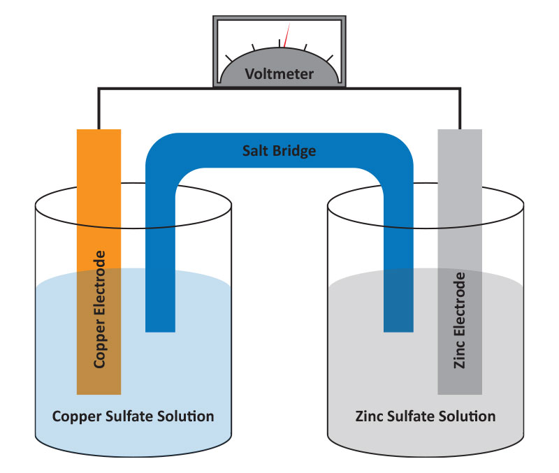

A metal-metal ion electrode consists of a metal in contact with a solution containing its ions. The simplest example is a pure metal (like copper or zinc) placed in a solution of its ions (e.g., Cu²⁺ or Zn²⁺). The metal serves as the electrode, where oxidation or reduction can take place depending on the setup.

- **Example**: The copper electrode (Cu | Cu²⁺) and zinc electrode (Zn | Zn²⁺).
  
- **Electrode Reaction**:
  - For the copper electrode: 
   
   $$ \text{Cu}^{2+} + 2e^- \rightarrow \text{Cu (s)} $$
  
  - For the zinc electrode: 
   
   $$ \text{Zn (s)} \rightarrow \text{Zn}^{2+} + 2e^- $$

- **Applications**: Metal-metal ion electrodes are commonly used in simple galvanic cells (e.g., Daniell cells) and are studied in standard electrode potential measurements.

#### 2. **Gas Electrodes**

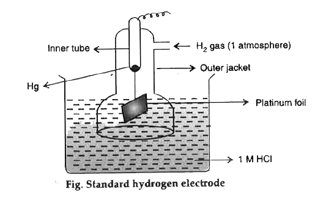

Gas electrodes involve a gas (often hydrogen or chlorine) in contact with an electrolyte solution and an inert conducting electrode, typically platinum, which acts as a surface for electron transfer. Gas electrodes are used to measure ion concentrations and pH values.

- **Hydrogen Electrode (Standard Hydrogen Electrode, SHE)**:
  - This is a reference electrode with an electrode potential defined as 0 V.
  - The electrode setup consists of a platinum electrode in contact with H₂ gas at 1 atm and a 1 M H⁺ solution.
  - **Reaction**: 
  
  $$ \text{H}_2 (g) \leftrightarrow 2\text{H}^+ + 2e^- $$

  - **Applications**: Used as a standard reference for measuring the electrode potentials of other electrodes and is fundamental in creating the electrochemical series.

- **Chlorine Electrode**: Involves chlorine gas in contact with a platinum electrode and an electrolyte containing chloride ions (Cl⁻).
  - **Reaction**: 
   
   $$ \text{Cl}_2 (g) + 2e^- \rightarrow 2\text{Cl}^- $$

- **Oxygen Electrode**: Similar to the chlorine electrode but with oxygen gas.
  - **Reaction**: 
   
   $$ \text{O}_2 (g) + 4\text{H}^+ + 4e^- \rightarrow 2\text{H}_2\text{O} $$

#### 3. **Insoluble Salt Electrodes**

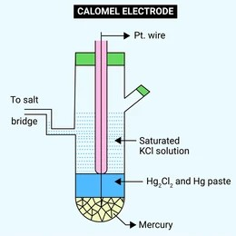

Insoluble salt electrodes consist of a metal in contact with an insoluble salt of the metal, along with a solution containing ions that the salt dissociates into. These electrodes are useful as reference electrodes due to their stable and reproducible potentials.

- **Calomel Electrode**: The calomel electrode is a widely used reference electrode, involving mercury (Hg), mercurous chloride (Hg₂Cl₂, also known as calomel), and a solution of potassium chloride (KCl).

  - **Structure**: A platinum or other inert electrode is coated with mercury and then with calomel. The KCl solution provides Cl⁻ ions in contact with the calomel layer.

  - **Half-cell Reaction**:
    
    $$
    \text{Hg}_2\text{Cl}_2 (s) + 2e^- \rightarrow 2\text{Hg (l)} + 2\text{Cl}^-
    $$

  - **Applications**: Commonly used as a stable reference electrode in pH meters, voltmeters, and other electrochemical devices. The calomel electrode is often preferred because of its ease of use and reliable potential.

  - **Potential Variation**: The electrode potential of the calomel electrode varies with the concentration of the KCl solution. Saturated KCl solution is most commonly used, providing a constant reference potential.

#### 4. **Redox Electrodes**

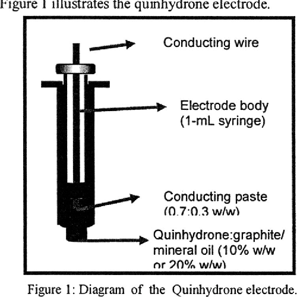

Redox electrodes involve two species of the same element in different oxidation states in a solution, with an inert conductor (like platinum) that facilitates electron transfer but does not participate in the reaction. Redox electrodes are useful for redox potential measurements in solutions where no metal is directly involved in the electrochemical reaction.

- **Quinhydrone Electrode**: A specific type of redox electrode used primarily to measure pH. It consists of quinhydrone (a mixture of benzoquinone and hydroquinone) dissolved in an acidic or basic solution.

  - **Half-cell Reaction**: 
    
    $$
    \text{C}_6\text{H}_4\text{O}_2 + 2\text{H}^+ + 2e^- \leftrightarrow \text{C}_6\text{H}_4(\text{OH})_2
    $$
  
  - **pH Measurement**: In this electrode, the potential depends on the hydrogen ion concentration (pH) of the solution. It can be calculated using the Nernst equation.

  - **Advantages**: Simple and effective for measuring pH in weakly acidic or weakly basic solutions. However, it is not reliable in highly acidic or basic solutions.

- **Other Redox Electrodes**: Similar setups with ions of different oxidation states, such as Fe²⁺/Fe³⁺ in solution, can also be used for redox measurements.

#### Summary

Each type of electrode has a specific function and is selected based on the nature of the electrochemical reaction or the type of measurement required:

- **Metal-metal ion electrodes** are ideal for studying the direct oxidation and reduction of metals.
- **Gas electrodes** like the hydrogen electrode are essential as references and are foundational in constructing electrochemical cells.
- **Insoluble salt electrodes**, such as the calomel electrode, are highly stable reference electrodes.
- **Redox electrodes** like the quinhydrone electrode are valuable in solutions where ions undergo redox changes without involving a solid metal.

<!--electrochemistry ends-->
<!--spectroscopy starts-->

# SPECTROSCOPY

## UV-VIS SPECTROSCOPY

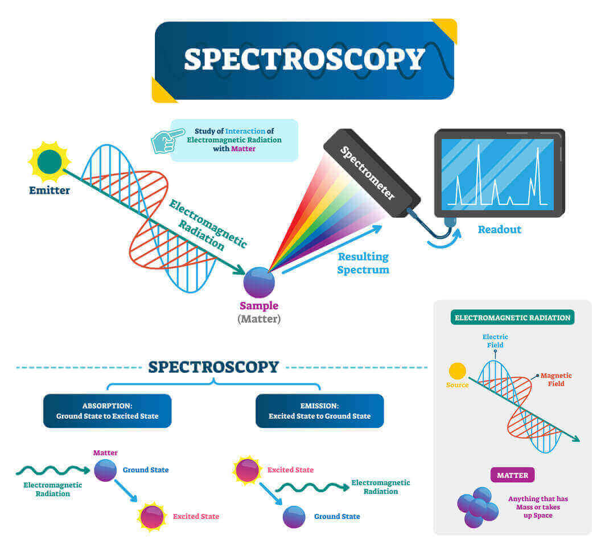

## 1. **Principle of UV-Visible Spectroscopy**

   UV-Visible spectroscopy is based on the absorption of light in the ultraviolet (UV) and visible regions of the electromagnetic spectrum. This absorption occurs when photons have sufficient energy to excite electrons from a lower energy state (ground state) to a higher energy state (excited state) within a molecule. The fundamental principle involves **electronic transitions** that occur due to the absorption of photons in specific energy ranges.

   In the UV-Vis spectrum, light wavelengths between **200 nm to 400 nm** (UV range) and **400 nm to 700 nm** (visible range) are typically observed. These wavelengths correspond to the energy needed to excite electrons, especially **π-electrons and non-bonding electrons** (n-electrons), to higher molecular orbitals. Different types of electronic transitions can occur:
   
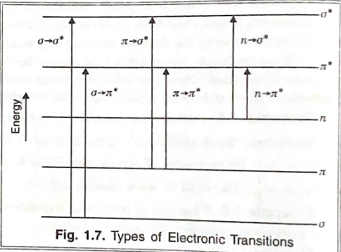

   - **σ → σ\*** (bonding to antibonding): Requires very high energy, generally outside UV-Vis range.
   - **n → σ\*** (non-bonding to antibonding): Found in compounds with lone pairs like oxygen, nitrogen, sulfur.
   - **π → π\*** (π-bonding to π-antibonding): Observed in compounds with double or triple bonds.
   - **n → π\*** (non-bonding to π-antibonding): Occurs in carbonyl and other conjugated systems.

## 2. **Instrumentation in UV-Visible Spectroscopy**

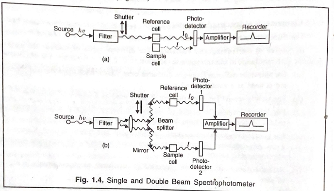

   UV-Vis spectroscopy instruments are designed to measure the intensity of light absorbed by a sample at different wavelengths. There are two main types of UV-Vis spectrophotometers: **single-beam** and **double-beam** spectrophotometers.

   #### Single-Beam Spectrophotometer

   In a single-beam spectrophotometer:
   - A single beam of light from the **light source** passes through the sample.
   - The sample absorbs part of the light, and the remaining light is detected by a **detector**.
   - The intensity of transmitted light is compared to a reference measurement.
   

   #### Double-Beam Spectrophotometer
   In a double-beam spectrophotometer:
   - The light beam from the source splits into two paths: one passing through the **sample cell** and the other through a **reference cell**.
   - The instrument alternates measurement of light intensity between the sample and reference cells, making it more accurate and stable.
   
   **Working Mechanism:**
   - Light passes through the **monochromator**, which isolates the specific wavelength.
   - This light then passes through the sample, and the detector measures the intensity of the transmitted light, converting it to an absorbance value.
   
## 3. **Chromophores and Auxochromes**
   

   - **Chromophore**: A chromophore is a part of a molecule that absorbs UV or visible light, causing an electronic transition. Common chromophores include **alkenes, carbonyl groups, and aromatic rings**.
   - **Auxochrome**: An auxochrome is a group attached to a chromophore that does not itself absorb light but alters the wavelength and intensity of absorption of the chromophore. Auxochromes are typically groups like **-OH, -NH₂, -Cl**, which contain lone pairs that can interact with the π-electrons of chromophores.

   **Effect of Auxochrome on Chromophore**:
   - The presence of an auxochrome increases the **conjugation** in a molecule, affecting the chromophore’s electron distribution.
   - This results in a **bathochromic shift** (red shift) or **hypsochromic shift** (blue shift) of absorption wavelengths, depending on how the auxochrome interacts with the chromophore.

## 4. **Bathochromic, Hypsochromic, Hyperchromic, and Hypochromic Shifts**
 
 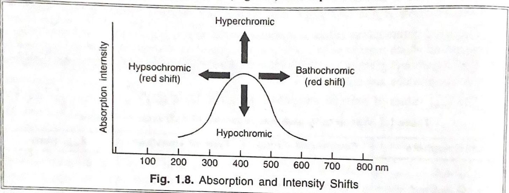
 
   - **Bathochromic Shift**: Also called a **red shift**, this shift occurs when the absorption maximum moves to a longer wavelength due to an increase in conjugation or the presence of electron-donating groups.
   - **Hypsochromic Shift**: Also known as a **blue shift**, this occurs when the absorption maximum shifts to a shorter wavelength, often due to the presence of electron-withdrawing groups or reduced conjugation.
   - **Hyperchromic Shift**: An increase in absorbance intensity at a given wavelength, often due to structural changes that enhance the probability of electronic transitions.
   - **Hypochromic Shift**: A decrease in absorbance intensity, typically due to structural alterations that lower the likelihood of electronic transitions.

## 5. **Applications of UV-Visible Spectroscopy**

   UV-Vis spectroscopy has a wide range of applications in analytical chemistry:
   
   - **Detection of Functional Groups**: UV-Vis can identify specific functional groups in organic compounds based on their characteristic absorbance spectra, such as carbonyl groups, alkenes, and aromatic systems.
   - **Distinction between Conjugated and Non-Conjugated Dienes**: Conjugated dienes show absorbance at longer wavelengths compared to non-conjugated dienes due to increased π-conjugation, aiding in structural analysis.
   - **Quantitative Analysis of Unknown Concentrations**: Using **Beer-Lambert's Law**, UV-Vis spectroscopy measures concentration by relating absorbance to concentration, making it essential for measuring trace substances in solution.
   - **Determination of Molecular Weight**: In biochemistry, UV-Vis is used to estimate molecular weights of proteins and nucleic acids by relating absorbance at specific wavelengths to concentration.
   - **Fluorescence and Phosphorescence**: UV excitation can cause some compounds to emit light at a different wavelength (fluorescence or phosphorescence), which is used to study molecular environments and dynamics.
   - **Isosbestic Points**: This concept is useful in reaction monitoring, where at a specific wavelength (isosbestic point), the absorbance of the reaction mixture remains constant as reactants are converted to products, indicating a clean reaction with no intermediates.

Each section here provides the foundation for understanding UV-Visible spectroscopy and its applications in chemistry. If you need further details on any specific topic, feel free to ask!

## IR SPECTROSCOPY

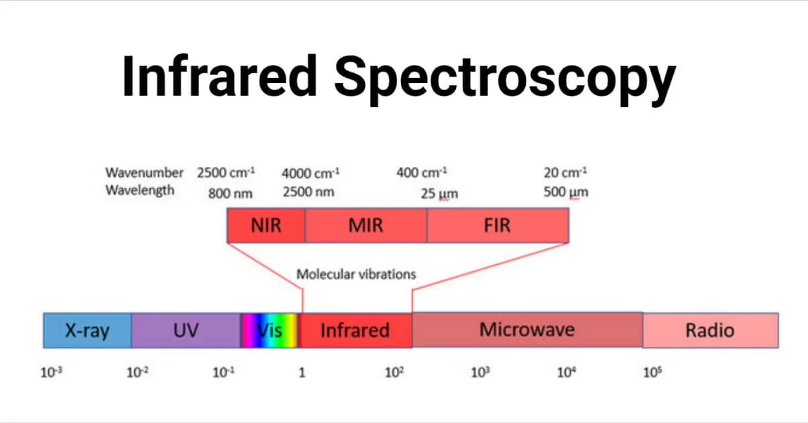

## 1. **Expanded IR Range and Spectral Subdivisions**

The IR range spans a large portion of the electromagnetic spectrum, which can be subdivided to target specific molecular motions and characteristics. Here’s a more detailed breakdown:

- **Near-IR (NIR) Region (0.8 – 2.5 μm, or 12,500 – 4,000 cm⁻¹)**: The NIR region often deals with overtone and combination bands, which are typically weak and less informative for functional group identification. However, NIR can be useful in specific applications like food quality analysis and pharmaceutical quality control, where molecular overtones provide insights into sample consistency.

- **Mid-IR (MIR) Region (2.5 – 25 μm, or 4,000 – 400 cm⁻¹)**: This region is the most informative for organic and inorganic analysis because it provides direct vibrational frequencies for functional groups. Most IR spectra obtained in laboratories are within this range, offering detailed information on molecular structures.

- **Far-IR (FIR) Region (25 – 1,000 μm, or 400 – 10 cm⁻¹)**: The far-IR region typically explores rotational and lattice vibrations, particularly for larger molecules and crystalline materials. FIR spectroscopy is applied in specialized studies, such as inorganic analysis of metal-ligand interactions, minerals, and polymeric materials, where lower-energy vibrations are informative.

## 2. **Detailed Exploration of Functional Group and Fingerprint Regions**

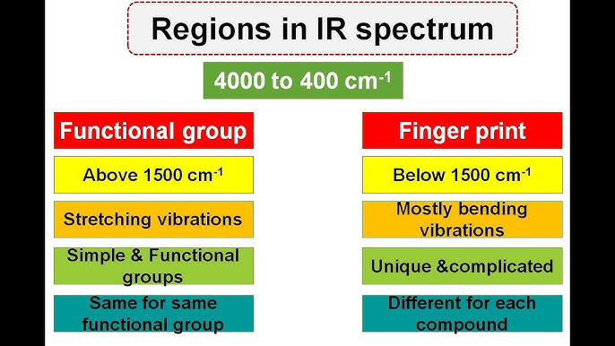

The IR spectrum of a molecule provides two crucial regions:
   - **Functional Group Region (4,000 - 1,500 cm⁻¹)**: In this region, specific peaks appear due to common functional groups, which absorb IR light at well-known frequencies. Some examples include:
     - **O-H Stretching (Alcohols and Phenols)**: Typically between 3,200 and 3,550 cm⁻¹, this peak appears as a broad absorption due to hydrogen bonding.
     - **C=O Stretching (Carbonyl Compounds)**: Carbonyls have sharp, strong peaks usually around 1,700 cm⁻¹, a reliable indicator of aldehydes, ketones, esters, and carboxylic acids.
     - **C≡N and C≡C Stretching (Nitriles and Alkynes)**: These bonds absorb strongly around 2,100 - 2,260 cm⁻¹.

   - **Fingerprint Region (1,500 - 400 cm⁻¹)**: This region is named because each molecule has a unique pattern of absorption peaks here, much like a fingerprint. This region represents complex vibrations unique to the entire molecular framework, rather than individual functional groups. Thus, even molecules with similar functional groups will show distinct spectra in this region, making it a valuable tool for identifying compounds conclusively.

## 3. **Expanded Instrumentation Overview and Types of IR Spectroscopy**

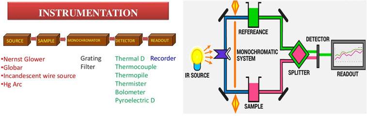

   Modern IR spectrometers are either **dispersive** (traditional) or **Fourier-transform infrared (FTIR)** spectrometers.

   #### Dispersive IR Spectroscopy
   - A dispersive IR spectrometer uses a **monochromator** (a device to select single wavelengths) to isolate each wavelength of IR light, which then passes through the sample. These instruments measure absorbance one wavelength at a time, which can be time-consuming.
   - **Advantages**: Simple and easy to use for routine measurements.
   - **Disadvantages**: Slower data collection; lower sensitivity compared to FTIR.

   #### Fourier-Transform Infrared (FTIR) Spectroscopy
   - FTIR spectroscopy uses a **Michelson interferometer** to collect all IR frequencies simultaneously, offering a quick and more accurate method for collecting spectra.
   - **Working Principle**: The Michelson interferometer splits IR light into two beams, which are recombined after traveling different paths. This creates an interference pattern (interferogram) that represents all IR frequencies at once. A Fourier transform mathematical function is then applied to convert this interferogram into an IR spectrum.
   - **Advantages**: Higher sensitivity, faster data acquisition, and better resolution, making FTIR ideal for high-quality, complex analyses.

## 4. **In-depth Analysis of Molecular Vibrations**

   Molecular vibrations fall into two main categories: **stretching** and **bending**. Each vibration type has unique characteristics based on bond type, molecular symmetry, and environmental factors.

   - **Stretching Vibrations**:
     - **Symmetric Stretching**: Both atoms move simultaneously toward and away from each other in a coordinated manner.
     - **Asymmetric Stretching**: One atom moves toward the bond center while the other moves away, resulting in more complex motion and often stronger IR absorbance.

   - **Bending Vibrations**:
     - **In-Plane Bending** (e.g., **scissoring** and **rocking**): Atoms move in the same plane as the bond axis.
     - **Out-of-Plane Bending** (e.g., **wagging** and **twisting**): Atoms move outside the plane of the bond axis.

   Diatomic molecules, with only two atoms, have a single vibrational mode (stretching). However, polyatomic molecules with three or more atoms have numerous vibrational modes, depending on their geometry and the number of atoms.

   **Example of Vibrations in Water (H₂O)**:

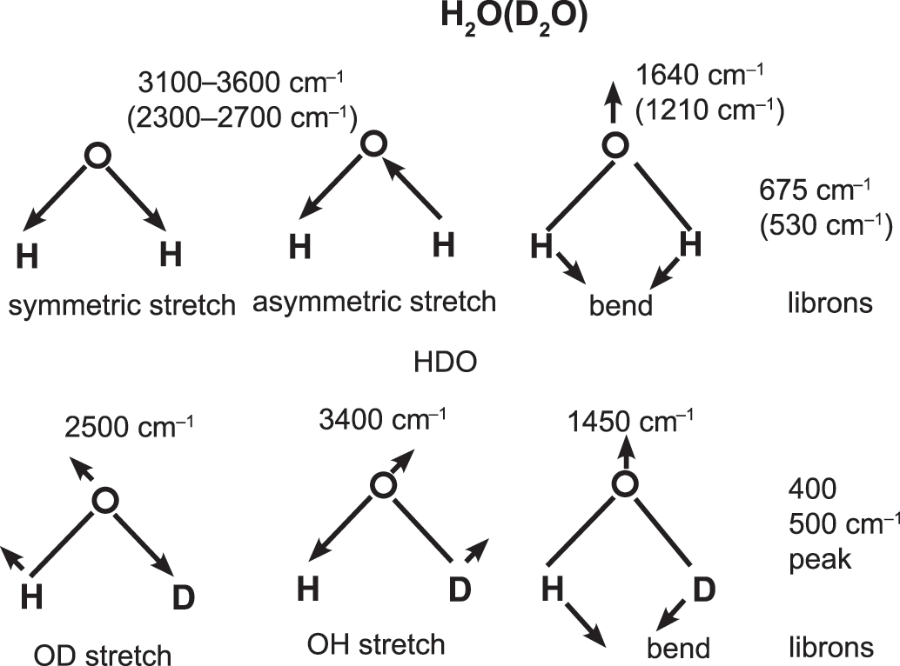

   - Water has three fundamental vibrational modes: **symmetric stretching**, **asymmetric stretching**, and **bending**. The unique combination of these vibrations in water provides characteristic peaks in its IR spectrum, helping detect water or hydroxyl groups in other substances.

## 5. **Expanded Explanation of Hook’s Law in IR Spectroscopy**

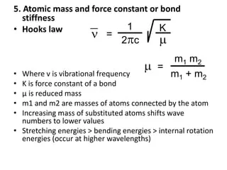

   Hook’s law provides insight into how bond strength and atomic mass affect vibrational frequencies. Heavier atoms result in lower frequencies, while stronger bonds (higher force constant \( k \)) vibrate at higher frequencies. For instance:
   
   - **C-H Bonds**: Light hydrogen atoms lead to high vibrational frequencies, typically around 3,000 cm⁻¹.
   - **C=O Bonds**: Carbonyl bonds, with a relatively high force constant, have strong IR absorptions around 1,700 cm⁻¹.

   By using Hook’s law, IR spectroscopy can predict vibrational frequencies for a variety of bonds, making it a powerful tool for identifying functional groups based on observed peaks in the spectrum.

## 6. **Expanded Applications of IR Spectroscopy**

   IR spectroscopy finds applications across various fields due to its ability to provide both qualitative and quantitative information.

   - **Material Characterization**: In material science, IR spectroscopy is crucial for identifying polymer structures, coatings, and contaminants. For instance, the identification of plastic types (e.g., polyethylene vs. polypropylene) can be confirmed by their unique IR fingerprints.

   - **Environmental Monitoring**: IR spectroscopy is used to detect atmospheric gases like CO₂, CH₄, and N₂O, as each gas has specific IR absorption bands. It’s widely applied in monitoring air quality, greenhouse gas levels, and industrial emissions.

   - **Biomolecular Analysis**: In biochemistry, IR spectroscopy helps study biomolecules such as proteins, lipids, and nucleic acids. For example:
     - **Amide I and II Bands**: These bands provide information about protein secondary structure, with α-helix and β-sheet structures showing characteristic absorbances in the IR spectrum.
     - **Phospholipids and Carbohydrates**: IR can reveal lipid and carbohydrate composition based on unique C-H, C=O, and O-H vibrations, helping in the analysis of cell membranes and metabolic studies.

   - **Pharmaceutical Quality Control**: IR spectroscopy monitors drug purity, stability, and composition. It helps in verifying raw materials, detecting counterfeit drugs, and confirming active ingredients in formulations. FTIR spectroscopy is especially valuable for this due to its accuracy and speed.

   - **Forensic Science**: IR spectroscopy assists in analyzing evidence such as fibers, residues, drugs, and explosives. The fingerprint region provides a unique spectral pattern that can match unknown samples with known references.

   - **Conjugation and Electronic Effects**:
     
     

     - **Conjugation** in molecules (such as alternating single and double bonds) leads to delocalized electrons, which lower bond strength and shift IR absorption to lower frequencies. For example, a carbonyl group conjugated with an aromatic ring absorbs at a lower wavenumber than a non-conjugated carbonyl group.
     - **Electron-Withdrawing and Electron-Donating Groups**: Substituents affect bond polarization, shifting IR absorption. An electron-withdrawing group (like -NO₂) attached to a benzene ring shifts the C=O stretch to higher wavenumbers, while electron-donating groups shift it to lower wavenumbers.

## 7. **Advancements in IR Spectroscopy: Attenuated Total Reflectance (ATR)**

   Attenuated Total Reflectance (ATR) is a modern technique that simplifies sample preparation and enables direct analysis of solids, liquids, and gels without extensive preparation.

   - **Working Principle**: ATR uses a crystal with a high refractive index (like diamond or ZnSe) in contact with the sample. When IR light is directed into the crystal at a certain angle, it undergoes total internal reflection. The sample absorbs IR radiation at the contact point, creating an evanescent wave that penetrates a few micrometers into the sample, producing a spectrum.

   - **Advantages of ATR**:
     - Minimal sample preparation: Solid and liquid samples can be analyzed directly.
     

 Compatible with a wide range of samples: ATR can be used on polymers, biological samples, and even in aqueous solutions, making it versatile.

   - **Applications of ATR**: ATR-IR is particularly valuable in analyzing biological samples, environmental samples (like soil or water), and surface layers on materials, providing insights into composition, structure, and possible contamination.

## NMR SPECTROSCOPY

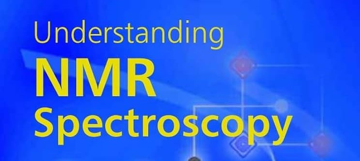

## 1. **Nuclear Magnetic Resonance (NMR) Spectroscopy: Extended Overview**

Nuclear Magnetic Resonance (NMR) spectroscopy is a non-destructive technique used to investigate the atomic and molecular structure of organic and inorganic compounds. It is primarily used to study the interaction of atomic nuclei with electromagnetic radiation (radiofrequency) in the presence of a magnetic field. The technique is invaluable in the elucidation of molecular structures, detection of functional groups, and understanding the dynamic behavior of molecules.

## **Magnetic Nuclei and Their Interactions**

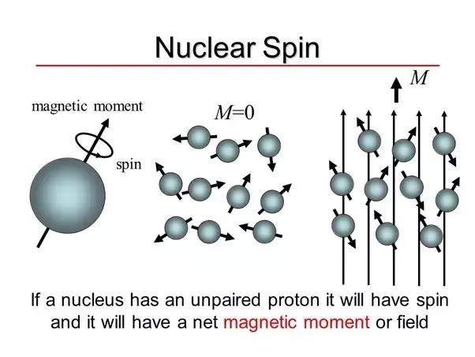

The key to NMR lies in the **magnetic properties of certain nuclei**. Not all nuclei exhibit magnetic properties; for NMR to work, the nucleus must have an **odd number of protons** or **neutrons**, as only such nuclei possess a magnetic moment. Examples of nuclei that are commonly studied in NMR include:
- **Proton (¹H)**: The most common nucleus studied in NMR, found in most organic compounds.
- **Carbon-13 (¹³C)**: Another important nucleus, especially for carbon-containing compounds.
- **Fluorine (¹⁹F)**, **Phosphorus (³¹P)**, and **Nitrogen (¹⁵N)**: These are used in specialized NMR applications.

The magnetic nuclei interact with external magnetic fields and are subject to **resonance frequencies**. This occurs when the nuclei flip their spin orientation in response to a radiofrequency pulse, absorbing energy and moving to a higher energy state. The precise frequency at which this flipping occurs is specific to the magnetic field strength and the type of nucleus.

#### **Larmor Frequency and Processional Motion**

Each nucleus has a unique precessional frequency, termed the **Larmor frequency**, which is dependent on the **gyromagnetic ratio (γ)** of the nucleus and the strength of the magnetic field (B₀). The Larmor frequency \( ν \) is given by the formula:

$$
\nu = \frac{\gamma B_0}{2\pi}
$$

Where:
- $$ \gamma $$ is the **gyromagnetic ratio**, a constant that depends on the type of nucleus (for example, protons have a different γ value compared to carbon-13).
- $$ B_0 $$ is the magnetic field strength.
  
The nuclei in the sample align either with or against the magnetic field. When an RF pulse is applied at the Larmor frequency, the nuclei absorb energy and flip to a higher energy state. When the RF pulse is turned off, the nuclei relax back to their original state, emitting energy in the form of **radiofrequency signals**. These signals are detected and transformed into a spectrum.

## 2. **Principle of NMR Spectroscopy: The Energy Transitions**

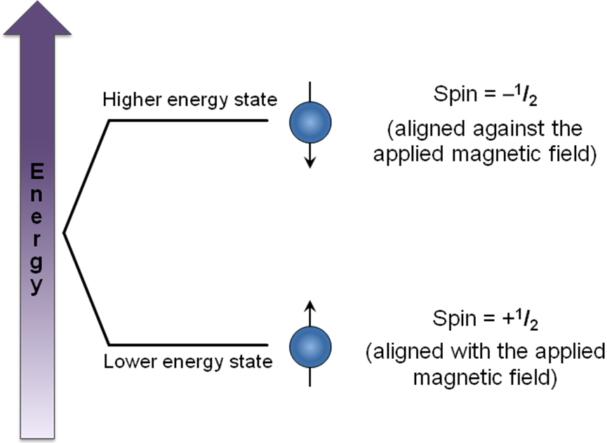

The primary principle of NMR is based on the absorption of electromagnetic radiation by atomic nuclei in a magnetic field, leading to a transition between different spin states. However, the frequencies at which different nuclei resonate depend not only on the strength of the applied magnetic field but also on the **chemical environment** of the nucleus. This phenomenon is called **chemical shift**.

#### **Chemical Shift (δ) and Its Units**

The **chemical shift (δ)** refers to the change in resonance frequency due to the electronic environment surrounding the nucleus. Chemical shifts are expressed in parts per million (ppm) relative to a standard reference, typically **tetramethylsilane (TMS)** for proton NMR. The formula to calculate chemical shift is:

$$
\delta = \frac{(v_{sample} - v_{TMS})}{v_{ref}} \times 10^6
$$

Where:
- $$ v_{sample} $$ is the resonance frequency of the sample,
- $$ v_{TMS} $$ is the resonance frequency of TMS,
- $$ v_{ref} $$ is the reference frequency.

Chemical shifts provide important clues about the types of chemical environments present in a molecule. For instance:

- **Alkyl protons** (CH₃, CH₂) typically resonate around **0.5–2.0 ppm**.
- **Aromatic protons** (on a benzene ring) resonate in the range of **6.0–8.5 ppm**.
- **Alcohol (-OH) protons** appear around **1.0–5.5 ppm**, depending on hydrogen bonding.

#### **Spin-Spin Coupling and Multiplets**

In NMR, **spin-spin coupling** occurs when two or more non-equivalent nuclei influence each other's magnetic environments. This leads to the splitting of a signal into multiple peaks, called **multiplets**. The number of peaks and the splitting pattern depend on the number of neighboring protons and their relative positions.

- For example, a proton adjacent to a single non-equivalent proton will result in a **doublet** (two peaks).
- A proton adjacent to two non-equivalent protons will result in a **triplet**.
- More complex splittings can occur when multiple neighboring protons interact, leading to **quartets**, **multiplets**, etc.

The multiplicity pattern follows the **n+1 rule**, where **n** is the number of adjacent protons. This rule applies to **equivalent protons** in a simple environment.

## 3. **1H NMR of Simple Organic Molecules**

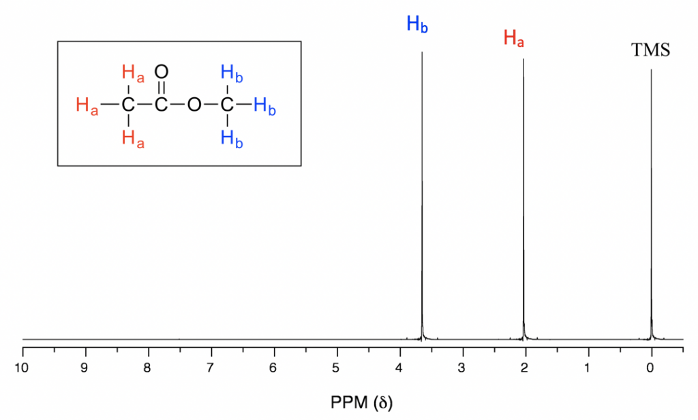

Let’s examine the ¹H NMR spectra of three simple molecules to understand how NMR helps us interpret their structure.

#### **1. Ethane (CH₃-CH₃)**

In ethane, the molecule consists of two **equivalent methyl groups (CH₃)**. The NMR spectrum would show:
- A **single peak** at **1.0 ppm** due to the two equivalent methyl groups.
- No splitting is observed since there are no neighboring non-equivalent protons to interact with.

Thus, ethane gives a very simple spectrum with one peak corresponding to the two **equivalent protons**.

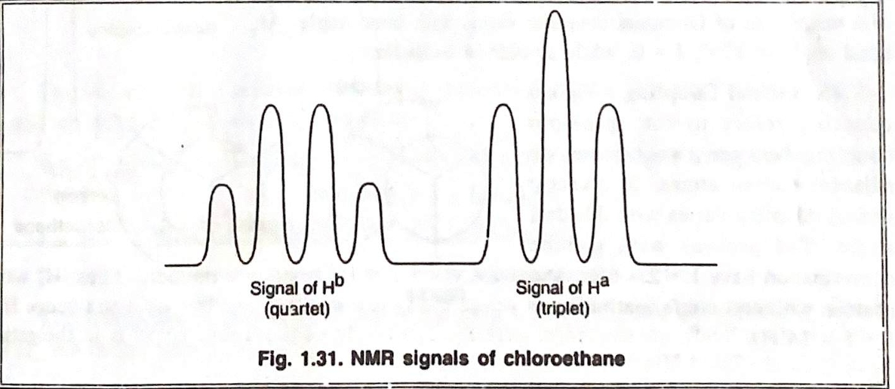

#### **2. Ethyl Chloride (CH₃-CH₂Cl)**

Ethyl chloride consists of a **methyl group (CH₃)** and a **methylene group (CH₂)** adjacent to a chlorine atom. In the NMR spectrum:
- The **methyl protons** (CH₃) appear as a **triplet** at around **1.0 ppm** due to coupling with the adjacent CH₂ protons.
- The **methylene protons** (CH₂) appear as a **quartet** at **3.5 - 4.0 ppm** due to coupling with the three equivalent protons on the adjacent methyl group.
- The chlorine atom, being electronegative, causes a deshielding effect on the CH₂ protons, which results in the chemical shift appearing at a higher ppm.

Thus, the spectrum of ethyl chloride displays a **triplet** for the CH₃ protons and a **quartet** for the CH₂ protons.

#### **3. Phenol (C₆H₅OH)**

Phenol contains an aromatic ring with a hydroxyl group. In the ¹H NMR spectrum:
- The **aromatic protons** resonate as a **multiplet** in the region **6.5–8.0 ppm**, reflecting the different chemical environments of the protons on the benzene ring. The exact splitting pattern depends on the substitution pattern on the ring.
- The **hydroxyl proton (-OH)** appears as a broad **singlet** around **4.5–5.5 ppm**, due to hydrogen bonding with the hydroxyl group and the environment.

The spectrum of phenol provides characteristic signals for the aromatic ring and the hydroxyl group.

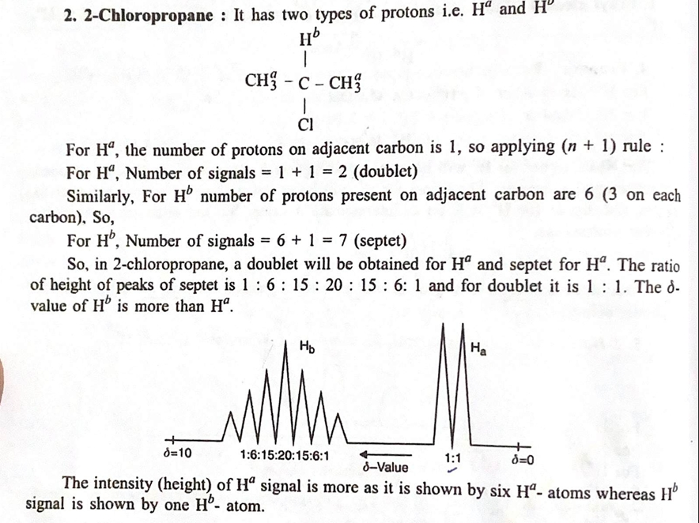
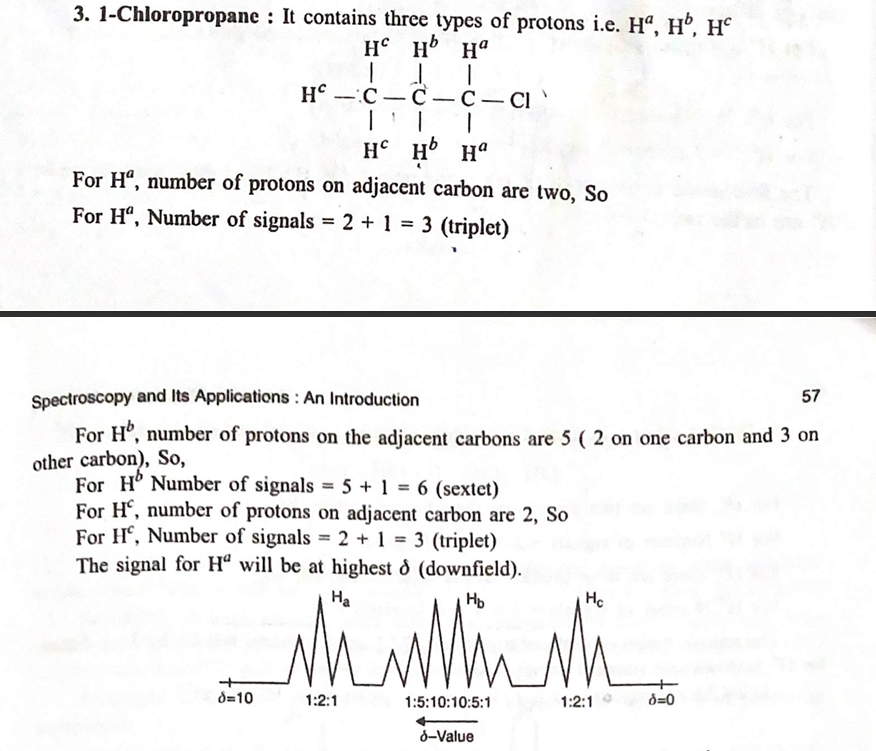
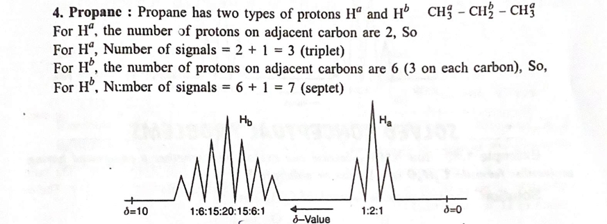
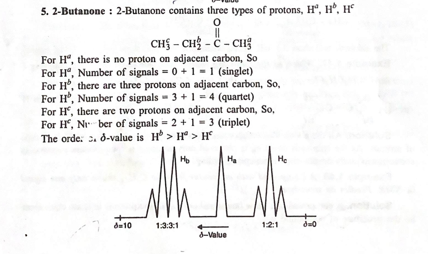
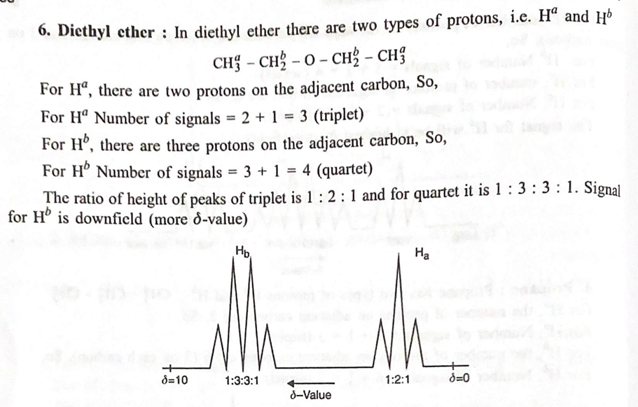

## 4. **Applications of ¹H NMR Spectroscopy**

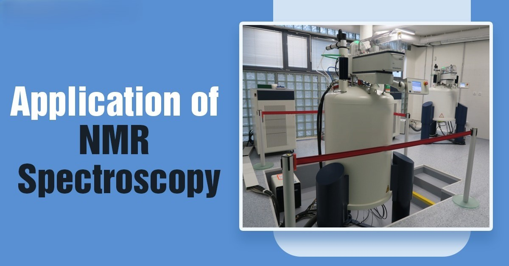

¹H NMR is one of the most widely used techniques for structure elucidation, and its applications extend across multiple fields, from organic chemistry to pharmaceuticals, materials science, and beyond.

#### **1. Detection of Aromaticity**

Aromatic compounds, such as benzene and its derivatives, have characteristic **multiplet patterns** in the **6.0–8.5 ppm** range. The protons on the aromatic ring experience coupling with each other, leading to a series of peaks that can be used to deduce the position of substituents on the ring. The presence of a benzene ring is easy to identify in an unknown sample based on these signature shifts.

#### **2. Detection of Cis- and Trans-Isomers**

Cis-trans isomerism (geometrical isomerism) occurs in molecules with double bonds, such as alkenes. In **cis-alkenes**, the protons on the same side of the double bond experience greater coupling, leading to larger splitting patterns compared to **trans-alkenes**, where the protons are on opposite sides of the double bond.

For example:
- A **cis-alkene** shows **stronger splitting** in the NMR spectrum due to closer proximity of the protons.
- A **trans-alkene** shows **less splitting** because the protons are further apart.

Thus, NMR can differentiate between cis- and trans-isomers based on the splitting pattern and coupling constants.

#### **3. Detection of Structural Isomers**

Structural isomers are molecules that have the same molecular formula but different structural arrangements. NMR is particularly useful for distinguishing between isomers, as each isomer will have a unique set of **chemical shifts** and **coupling patterns**. For example:
- **Butanol** (CH₃CH₂CH₂OH) and **isobutanol** (CH₃CH(OH)CH₃) are structural isomers. Their NMR spectra will differ, particularly in the chemical shifts of

 the protons adjacent to the hydroxyl group and in the splitting patterns of the methyl and methylene groups.

#### **4. Detection of Electronegative Atoms**

Electronegative atoms, such as **chlorine**, **oxygen**, or **nitrogen**, have a **deshielding effect** on nearby protons, causing their signals to appear at higher ppm values. In compounds with functional groups such as alcohols, amines, or alkyl halides, NMR can detect the presence of these atoms based on the characteristic shifts of the protons near them.

For example:
- The **hydroxyl proton** in alcohols (like phenol) appears downfield due to the electron-withdrawing nature of oxygen.
- **Chlorine** in alkyl chlorides causes the nearby methylene proton to resonate at a higher ppm than in alkanes without chlorine.

## **Conclusion**

NMR spectroscopy, particularly ¹H NMR, is an indispensable tool in modern chemistry, providing insights into molecular structure, functional groups, and isomerism. By interpreting the chemical shifts, multiplicity patterns, and integration of peaks, chemists can deduce the structure of unknown compounds, differentiate between isomers, and even study dynamic changes in molecules. The versatility and non-destructive nature of NMR make it an invaluable tool for applications ranging from academic research to pharmaceutical development and quality control.

This extended exploration of NMR highlights its importance and wide-ranging applications, cementing it as one of the most powerful techniques in analytical chemistry.

# POLYMERS

### **Polymers: Expanded Overview**

Polymers are a class of materials that consist of long, repetitive chains of molecules called **monomers**. These versatile materials have found applications in nearly every aspect of human life, from everyday items like packaging and clothing to advanced engineering materials used in electronics, aerospace, and biomedicine. Understanding the principles of polymer chemistry—such as their nomenclature, functionality, polymerization methods, structure-property relationships, and applications—gives insight into their broad utility and technological importance.

This extended discussion of polymers will delve deeper into their classification, types of polymerization methods, detailed examples of thermoplastic and thermosetting resins, as well as specialized polymers like conducting polymers and nanomaterials such as fullerenes and nanoparticles. We will also explore the effects of polymer structure on properties, the mechanical properties of polymers, and the fascinating world of polymer blends and alloys, as well as nanotechnology innovations.

## **1. Introduction to Polymers**

### **Nomenclature of Polymers**

The naming of polymers generally follows the structure of the repeating unit in the polymer chain. The nomenclature can be divided into two broad categories:

1. **Addition Polymers:** These are polymers formed by the **addition reaction** where unsaturated monomers (usually alkenes) link together to form a polymer. For example:
  
  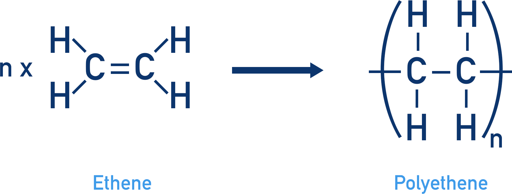

   - **Polyethylene (PE)** is made from **ethylene (C₂H₄)** monomers.
   - **Polypropylene (PP)** is made from **propene (C₃H₆)** monomers.

2. **Condensation Polymers:** These are formed by **condensation reactions** where two different monomers join to eliminate a small molecule, such as water or alcohol. Examples include:
  
  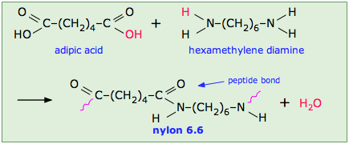
  
   - **Polyethylene terephthalate (PET)** formed from **terephthalic acid** and **ethylene glycol**.
   - **Nylon 6,6**, which is made from **hexamethylenediamine** and **adipic acid**.

### **Functionality of Polymers**

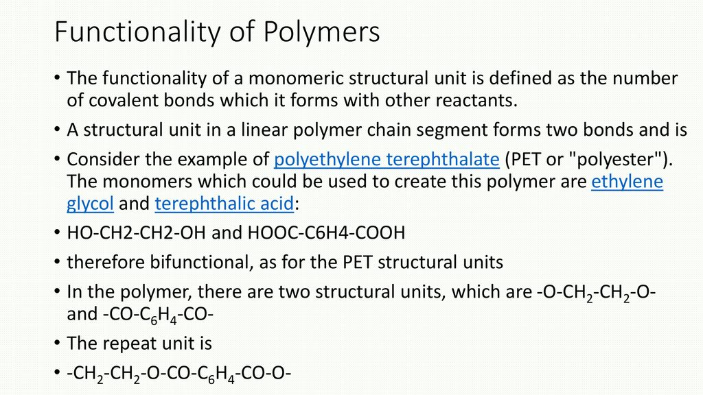

Functionality refers to the number of reactive sites available in the monomer that can participate in the polymerization process. A **monofunctional** monomer has one reactive site, **bifunctional** monomers have two reactive sites, and **multifunctional** monomers can form more complex networks due to more than two reactive sites.

- **Monofunctional Monomers**: These are the simplest monomers with one reactive site, usually forming **linear polymers**. Examples include **ethylene** (used to make polyethylene) and **styrene** (used to make polystyrene).
  
- **Bifunctional Monomers**: These monomers have two reactive sites and form **linear or branched** polymers, depending on how they react. For example, **ethylene glycol** and **terephthalic acid** are bifunctional monomers that form **polyethylene terephthalate (PET)**.

- **Multifunctional Monomers**: These monomers have more than two reactive sites and lead to the formation of **cross-linked polymers** or **network polymers**. Such polymers exhibit different properties than linear polymers, including higher melting points and greater mechanical strength. An example of a multifuctional monomer is **hexamethylenediamine**, used in the formation of **Nylon 6,6**.

### **Types of Polymerization**

There are three main types of polymerization methods used to form polymers: **addition polymerization**, **condensation polymerization**, and **copolymerization**.

1. **Addition Polymerization (Chain Growth Polymerization)**:
  
  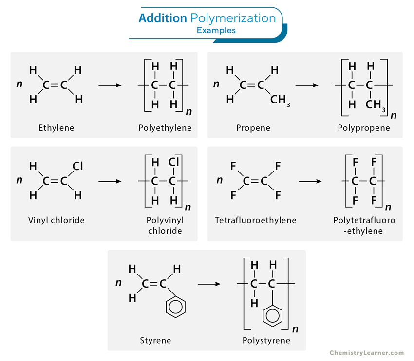
  
   In this process, monomers with a double bond or other unsaturation react to form a polymer without the loss of any atoms. This reaction involves three key steps:
   - **Initiation:** A free radical, cation, or anion initiates the polymerization by attacking the monomer, breaking its double bond and creating a reactive site for further addition.
   - **Propagation:** The reactive site of the monomer reacts with another monomer, and the chain grows.
   - **Termination:** The polymerization stops when two active chains combine, or when the active site is neutralized by other means.
   
   Example: **Polyethylene (PE)** and **Polyvinyl chloride (PVC)** are produced through addition polymerization.

2. **Condensation Polymerization (Step Growth Polymerization)**:
 
 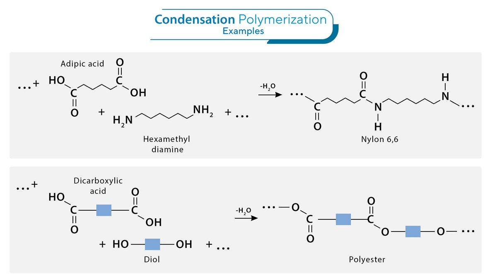
 
   This process involves the reaction of two or more different monomers, each containing two or more functional groups. Each reaction typically results in the elimination of a small molecule like water or methanol.
   
   Example: **Polyester (PET)** and **Nylon** are produced through condensation polymerization.

3. **Copolymerization**:
   Copolymerization refers to the process of polymerizing two or more different types of monomers together. This allows for the synthesis of polymers with a broader range of properties and characteristics than those made from a single monomer.
   
   Examples: **Styrene-butadiene rubber (SBR)** and **ethylene-vinyl acetate (EVA)** are copolymers.

## **2. Types of Polymers**

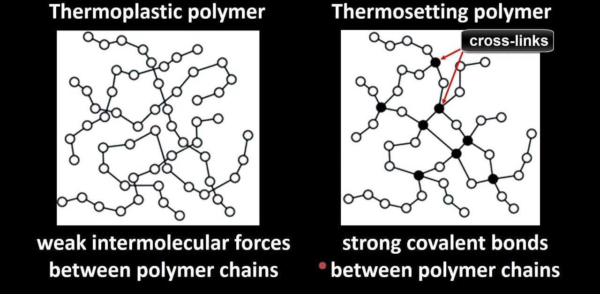

### **Thermoplastic Resins (Cellulose Derivatives)**

Thermoplastics are polymers that soften when heated and solidify when cooled, making them easy to shape and mold. **Cellulose derivatives** are a class of thermoplastics that are made from cellulose, the primary structural component of plant cell walls.

- **Cellulose Acetate**: Produced by the acetylation of cellulose, cellulose acetate is used in applications such as film production and as a plastic material in eyeglass frames and photographic film.

- **Cellulose Nitrate**: Made by nitrating cellulose with a mixture of sulfuric and nitric acids, cellulose nitrate is used in applications requiring strong, flexible, and transparent materials, such as in the production of **explosive materials** and **celluloid film**.

### **Thermosetting Resins (Phenolic Resin)**

Thermosets are polymers that harden when heated and cannot be remelted or reshaped once they are cured. These resins typically form **cross-linked structures**, which give them higher strength and stability at high temperatures.

- **Phenolic Resin**: One of the oldest types of thermosetting resins, phenolic resins are made by the reaction of **phenol** with **formaldehyde** in the presence of a catalyst. These resins are **cross-linked**, giving them high heat resistance, electrical insulating properties, and rigidity. They are used in applications such as **automotive components**, **electrical insulators**, and **laminates** (e.g., **Bakelite**).

## **3. Specialized Polymers**

### **Inorganic Polymers**

Inorganic polymers are a class of polymers in which the backbone chain is made up of elements other than carbon. Examples include **polyphosphazines**, **sulfur-based polymers**, and **silicones**.

- **Polyphosphazines**: These are inorganic polymers that have alternating phosphorus and nitrogen atoms in the backbone. The structure of polyphosphazines offers unique properties such as thermal stability and chemical resistance, making them useful in coatings and high-performance materials.

- **Sulfur-based Polymers**: These polymers are formed by the polymerization of sulfur and sulfur compounds. **Polysulfides** are commonly used in sealants, adhesives, and rubber materials due to their flexibility and resistance to degradation.

- **Silicones**: Silicones are a class of **inorganic-organic hybrid polymers** made from silicon-oxygen bonds in the backbone, with organic groups (such as methyl or phenyl) attached to the silicon atoms. They are widely used in applications requiring flexibility, water resistance, and thermal stability, such as in **sealants**, **lubricants**, **electrical insulation**, and **medical devices**.

### **Conducting Polymers**

Conducting polymers are organic polymers that can conduct electricity. Unlike traditional insulative plastics, conducting polymers are capable of carrying electric current, and their conductivity can be manipulated through doping processes.

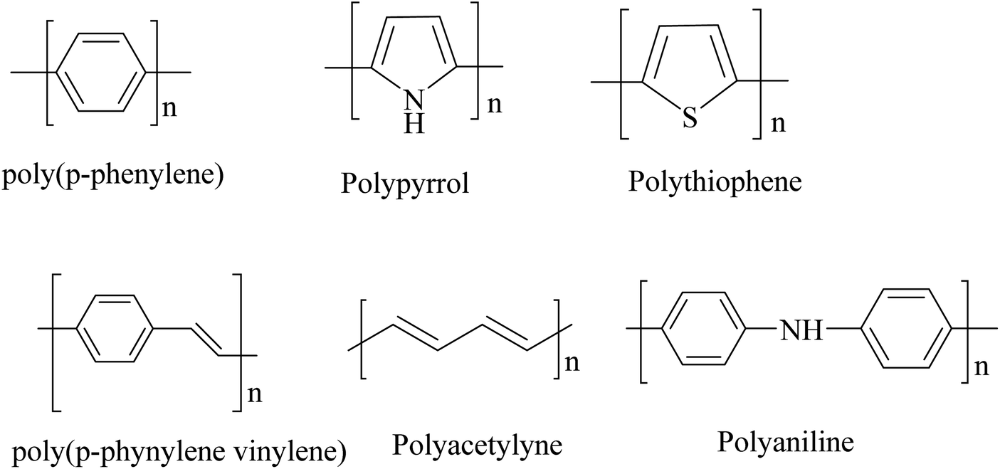

- **Polyaniline (PANI)**, **polypyrrole (PPy)**, and **polythiophene** are examples of conducting polymers. These materials have potential applications in **sensors**, **batteries**, and **electronic devices**.

## **4. The Effect of Polymer Structure on Its Properties**

The physical and chemical properties of a polymer depend heavily on its molecular structure. The following aspects of polymer structure influence its behavior:

- **Molecular Weight**: Higher molecular weights generally result in polymers with greater strength, higher melting points, and better wear resistance. For instance, **high-density polyethylene (HDPE)** has a higher molecular weight than **low-density polyethylene (LDPE)** and exhibits better mechanical properties.

- **Degree of Crystallinity**: Polymers can either be amorphous (without a regular structure) or crystalline (with an ordered molecular arrangement). **Crystalline polymers** typically have higher density, better tensile strength, and improved heat resistance. For example, **nylon** and **polypropylene** exhibit crystalline structures that enhance their mechanical strength.

- **Cross-Linking**: The presence of **cross-links** (chemical bonds between polymer chains) significantly improves the stability and strength of a polymer. **Thermosets** like **epoxy resins** and **phenolic resins** rely on cross-linking to form a rigid structure.

- **Functional Groups**: The presence of certain functional groups such as **hydroxyl**, **carboxyl**, **amine**, or **halogen** can introduce **polar interactions**, **hydrogen bonding**, and other forces that modify the polymer’s sol

ubility, thermal properties, and mechanical strength.

## **5. Nanomaterials: Fullerenes and Inorganic Nanoparticles**

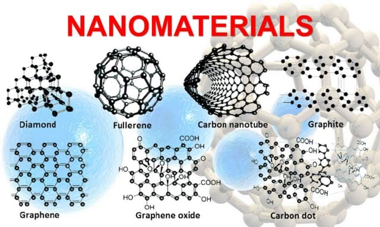

Nanotechnology is a rapidly advancing field that involves the manipulation of materials at the molecular or atomic scale. Polymers play an essential role in nanotechnology, particularly through the use of **fullerenes** and **nanoparticles**.

### **Fullerenes**

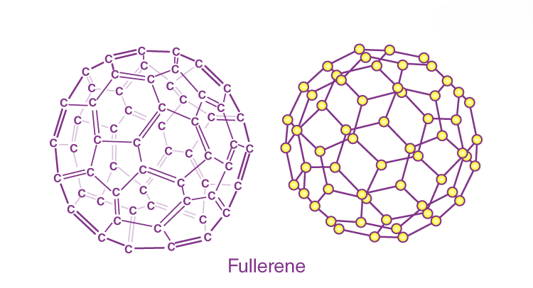

Fullerenes are a class of carbon molecules that form hollow structures, such as **buckyballs** and **bucky tubes**. These molecules are notable for their stability, unique electronic properties, and potential applications in **medicine**, **electronics**, and **energy storage**.

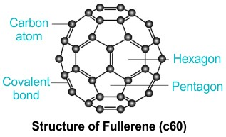

- **Buckyballs**: Fullerenes with a structure resembling a soccer ball (C₆₀) are known for their extraordinary **electrical conductivity** and **chemical reactivity**, making them promising for use in **solar cells**, **battery electrodes**, and **drug delivery systems**.

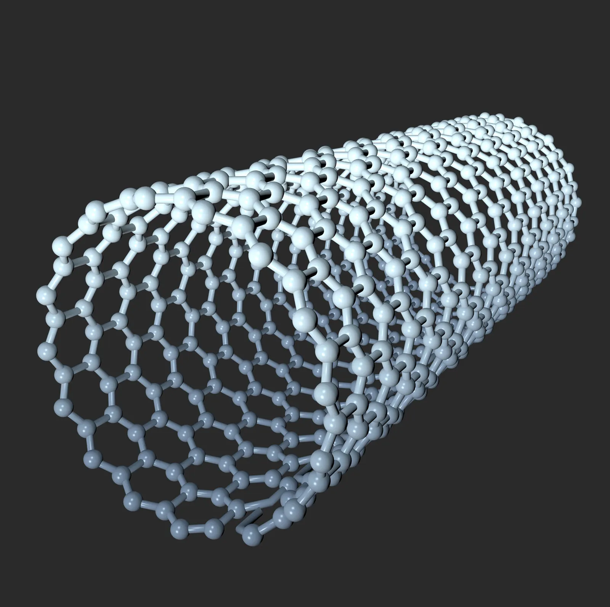

- **Nanotubes**: Fullerenes can also form cylindrical structures known as **carbon nanotubes (CNTs)**. These are incredibly strong, lightweight, and have excellent electrical conductivity, making them ideal for applications in **nanoelectronics**, **composite materials**, and **fuel cells**.

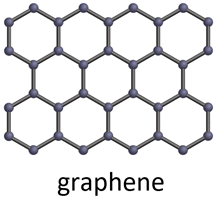

- **Graphene**: A single layer of carbon atoms arranged in a two-dimensional honeycomb lattice, graphene is renowned for its exceptional **strength**, **electrical conductivity**, and **thermal properties**. It holds potential for revolutionizing applications in **electronics**, **energy storage**, and **nanocomposites**.

### **Nanoparticles**

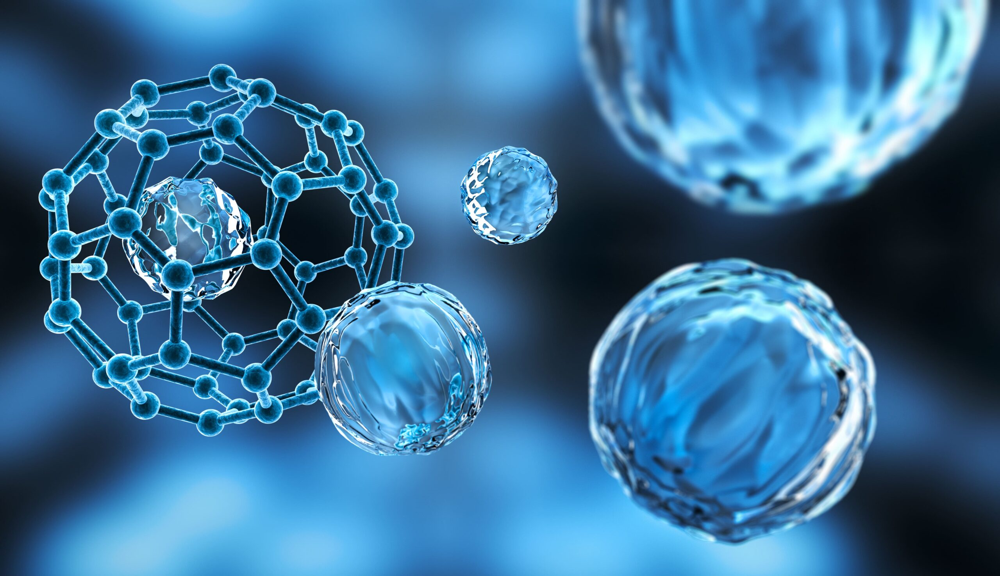

Nanoparticles are particles with dimensions on the order of **nanometers (1-100 nm)**. These materials can exhibit properties significantly different from their bulk counterparts, such as **enhanced reactivity**, **optical properties**, and **mechanical strength**.

- **Gold Nanoparticles (AuNPs)**: Known for their unique **optical properties** (plasmonic resonance), **gold nanoparticles** are used in **biomedical applications**, including drug delivery and imaging.

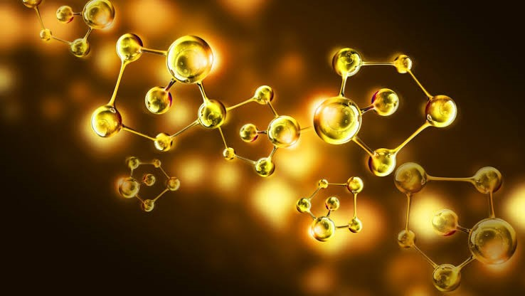

- **Quantum Dots**: These are semiconductor nanoparticles with unique optical properties that can be tailored by adjusting their size. **Quantum dots** are widely used in **LEDs**, **solar cells**, and **biological imaging**.

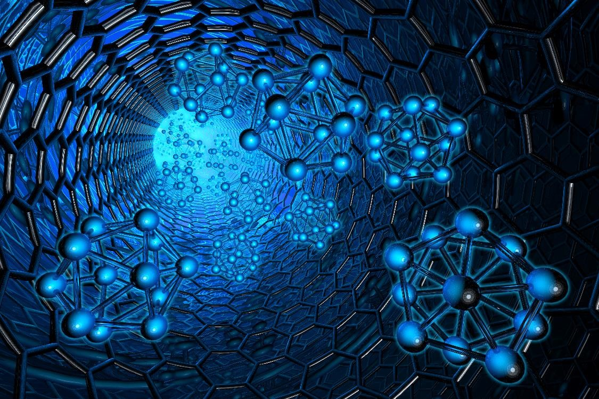

### **Optical Materials: OLEDs**

**Organic Light-Emitting Diodes (OLEDs)** are a class of materials used in **displays** and **lighting**. OLEDs consist of organic molecules that emit light when an electric current passes through them. These devices have revolutionized the display industry due to their ability to produce brighter, more energy-efficient displays with deeper black levels and flexibility.

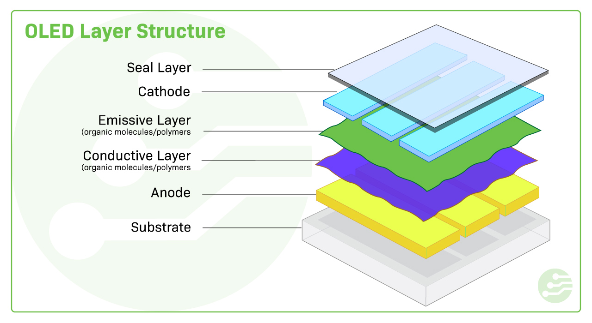

## **Conclusion**

Polymers are central to modern technology and industry, with their versatility and adaptability enabling their use in a wide range of applications, from packaging materials to advanced electronics and biomedicine. Their properties are determined by factors such as molecular weight, crystallinity, and functional groups, which can be tailored during synthesis. Additionally, specialized polymers such as conducting polymers and nanomaterials like fullerenes and nanoparticles are pushing the boundaries of what is possible in material science. Through a deeper understanding of polymer chemistry, we can continue to innovate and develop materials that meet the needs of an ever-evolving technological landscape.
